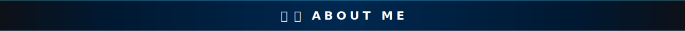
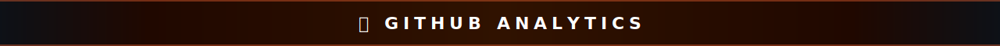
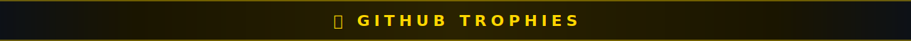

<!-- ████████████████████████████████████████████████████████████████████ -->
<!--           ANSH JAISWAL — GitHub Profile README v3                   -->
<!--           Cyberpunk Neon · 3D Effects · Full Analytics              -->
<!-- ████████████████████████████████████████████████████████████████████ -->

<div align="center">




<!-- ══════════════ TYPING ANIMATION ══════════════ -->
<br/>


<br/><br/>

<!-- ══════════════ ROLE BADGES ══════════════ -->
[](https://aktu.ac.in)
[](https://github.com/anshjdev)
[](https://github.com/anshjdev)
[](https://github.com/anshjdev)

<br/><br/>

<!-- ══════════════ SOCIAL LINKS ══════════════ -->
[](https://linkedin.com/in/anshjaiswal1)
[](mailto:jaiswalansh294@gmail.com)
[](https://github.com/anshjdev)

<br/>

<!-- ══════════════ COUNTERS ══════════════ -->

&nbsp;


</div>

---

<div align="center">

</div>

---



## 🧑‍💻 About Me

I am **Ansh Jaiswal**, an Information Technology undergraduate at **Dr. A.P.J. Abdul Kalam Technical University (AKTU)**, Class of 2028 — with a deep-rooted passion for **Software Engineering**, **Artificial Intelligence**, and **building things that ship**.

Most IT students spend their first two years attending classes. I spent mine interning at **two companies simultaneously** — applying AI automation and prompt engineering to real business problems at Radian Marketing, and producing educational AI content that grew an audience of thousands at AI Agent Bros. Ten months of real-world experience before most of my peers had their first internship.

My latest project, **CLUTCH**, is a 5-agent agentic AI deadline rescue system built in 7 days for a national hackathon. I don't just learn frameworks — I build with them, ship fast, and iterate.

I'm not waiting for graduation to matter. I'm already building.

### 🎯 Open To

- Software Engineering Internships
- Full Stack Development Roles
- AI/ML Engineering Projects
- Open Source Collaboration
- Hackathons & Tech Competitions

---


## 🛠️ Tech Stack

<div align="center">

### 💻 Languages


### ⚛️ Frontend


### 🔧 Backend & APIs


### ☁️ Cloud & DevOps


### 🤖 AI / ML & Databases


</div>

---

## 🧠 Software Engineering Expertise

| Domain | Proficiency | Details |
|---|---|---|
| Full Stack Development | **Learning** | React, FastAPI, Django, Node.js |
| Generative AI & LLMs | **Advanced** | Prompt engineering, Gemini API |
| AI Automation | **Learning** | Saved 5+ hrs/week with agentic workflows |
| Agentic Systems | **Intermediate** | Multi-agent pipelines, Gemini 1.5 Flash |
| Cloud & DevOps | **Intermediate** | Firebase, AWS, Docker |

---

## 🚀 Featured Projects

### ⚡ CLUTCH — Agentic AI Deadline Rescue System

> *"Raat ke 2 baj rahe hain. CLUTCH doesn't remind you — it rescues you."*

5 autonomous AI agents · React 18, Vite, Gemini 1.5 Flash, Firebase · Built in 7 days for **Vibe2Ship 2026** (Coding Ninjas × Google)

- 🧠 **Triage** — priority matrix in 10s &nbsp;·&nbsp; 📋 **Rescue Plan** — step-by-step micro-actions
- 📊 **Survival Score** — 0–100% honest probability &nbsp;·&nbsp; 📸 **Snap & Plan** — Gemini Vision reads your assignment

[](https://lnkd.in/ggMYm-ev)
[](https://github.com/anshjdev/Clutch)

---

## 💼 Experience

**🏢 AI Agent Bros** — Content & Video Editing Intern &nbsp;·&nbsp; *Sep 2025 – Feb 2026, 6 months*
- 20+ educational AI videos → 15%+ audience growth, 100% on-time delivery
- AI-assisted workflows cut video turnaround time by ~30%

**🏢 Radian Marketing** — AI Intern &nbsp;·&nbsp; *Sep – Dec 2025, 4 months*
- Saved ~5 hrs/week automating marketing tasks with AI; 40% faster content output
- Built reusable prompt engineering templates used across the team

---

## 🏅 Certifications

`Gemini Certified (Google)` `Deloitte Tech Job Simulation` `React Mastery` `E-Commerce React App` `Mobile App Development` `Prompt Engineering`

---

## 🗺️ Learning Roadmap

```yaml
Completed: CLUTCH (Vibe2Ship 2026) · 2 AI Internships · React, Gemini, Mobile Dev certs
Currently: System Design · AWS · LLM Orchestration · Vector DBs
Next: AWS Cloud Practitioner · Google Cloud AI · Microsoft AI-900
```

---



## 📊 GitHub Analytics

<div align="center">


&nbsp;&nbsp;


<br/><br/>


</div>

---



## 🏆 GitHub Trophies

<div align="center">


</div>

---

## 📈 Contribution Activity

<div align="center">


</div>

---


## 🐍 Contribution Snake

<div align="center">

<picture>
  <source media="(prefers-color-scheme: dark)" srcset="https://raw.githubusercontent.com/anshjdev/anshjdev/output/github-snake-dark.svg"/>
  <source media="(prefers-color-scheme: light)" srcset="https://raw.githubusercontent.com/anshjdev/anshjdev/output/github-snake.svg"/>
  
</picture>

</div>

---

## 🔭 Current Focus

```yaml
Building: AI-powered Full Stack apps · Agentic automation tools
Exploring: Vector DBs & RAG · Multi-Agent AI Architectures
Open_To: SWE Internships · AI/ML Roles · Hackathons · Open Source
```

---

## 🌐 Connect With Me

<div align="center">

[](https://linkedin.com/in/anshjaiswal1)
[](mailto:jaiswalansh294@gmail.com)
[](https://github.com/anshjdev)

<br/>

> *"Most IT students spend their first two years attending classes.*
> *I spent mine building things that matter."*
>
> — Ansh Jaiswal

<br/>

### *"Engineering intelligent systems today to solve the challenges of tomorrow."*

<br/>


</div>

<!-- ████████████████████████████████████████████████████████████████████ -->
<!-- Made with 💙 by Ansh Jaiswal  ·  github.com/anshjdev                -->
<!-- ████████████████████████████████████████████████████████████████████ -->
